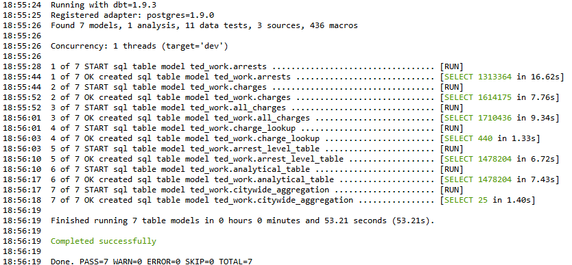
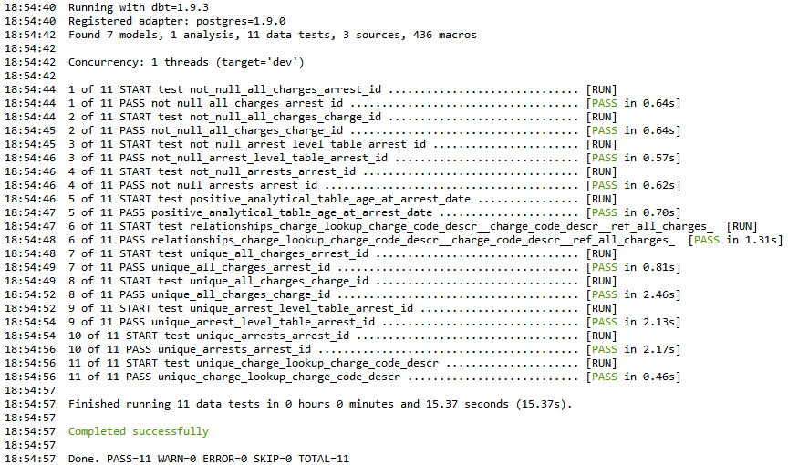

### Requirements
1. `requirements_geocoder.yml` for `./geocoder/` and `requirements.yml` for everything else
2. `cpd_infra_dev`, the Chicago PD Data Infrastructure (CPD Infra) dev database
2. `ul_geocoder`, the University of Chicago Crime Lab's internal geocoder

### About
These data models aim to systematically increase the granularity of drug violation arrests in CPD Infra. Presently, this fulfills a data request from the Above and Beyond Family Recovery Center: identify historical opioid possession arrests in Chicago at the citywide and community area levels (East and West Garfield Park). See `./models/schema.yml` for context on the models. Additionally, do `dbt docs generate --static` for the dbt documentation. Open the file in your browser, then click the blue icon on the lower right corner to visualize the underlying DAG.

### Instructions
1. Declare your CNet ID and password as environment variables called `DBT_USER` and `DBT_PASSWORD`, respectively. 
    - For QA, create your own schema in `cpd_infra_dev` (e.g, `ted_work_QA`); then, replace the `schema` key in `profiles.yml` accordingly. In `./python/config.yml`, make sure that the values under the `db_credentials` key match `profiles.yml`. I should really load `profiles.yml` into scripts in `./python/` to avoid rewriting credentials, but this works for now.
1. Activate `dbt_env` and do `dbt run` to materialize the SQL models onto CPD Infra. Do `dbt test` to run the data tests that I configured in `./models/schema.yml`.
1. Do `python ./python/citywide_aggregation.py` to query and visualize the `citywide_aggregation` model as a line plot, one line for each drug arrest in `./python/config.yml`'s `column_map` key. Vary the optional `start_year`, `max_y`, and `y_ticks` arguments as desired to customize the plot. I set it up this way because the y axis varies considerably based on which drug arrests I choose to retain in the visualizations.
1. Do `python ./python/query_table_from_db.py --table=analytical_table` to query the `analytical_table` model with row and column filters configured in `./python/config.yml`. It is exported to .csv in preparation for geocoding. Regarding the row filter, Chicago PD's 11th and 12th districts serve our two neighborhoods of interest: East and West Garfield Park. Lastly, this script can query any table in CPD Infra using my `Postgres` class in `./python/utils.py`; however, it is not optimized for large queries. This data pipeline has more than enough dependencies that I opted not to use CPD Infra's Python API.
1. Deactivate `dbt_env`, then activate `geocoder_env`. Do `python ./geocoder/geocode.py --input_path=$a --address_col=$b`, where `$a` is the path to the .csv file from step 4 while `$b` is either `arrest_address` or `home_address`. At this time, I am geocoding `arrest_address`: the address where the arrest took place.
1. Do `python ./geocoder/garfield_park.py --analytical_table=$a --analytical_table_geocoded=$b --chi_shp=$c`, where `$a` is the path to the .csv file from step 4; `$b` is the path to the .csv file from step 5; and `$c` is the .shp file of Chicago at the community area level. This maps the point coordinates to the shapefile, then aggregates annual opioid related and opioid possession arrests in Garfield Park.

Steps two to six are orchestrated in `orchestrate.sh`, so you don't need to manually run them. Instead, do `bash orchestrate.sh` or run it as executable; set the `run_dbt` and `run_geocoder` variables to `True` or `False` accordingly. Despite the length of this bash script, it takes no more than six minutes to run. Most but not all command line arguments in the Python scripts have default values, especially `config_file` and `output_dir`. In the spirit of modularity and specificity, I still pass in values to all arguments when invoking the scripts in `orchestrate.sh`.

### QA Instructions for dbt

1. `dbt debug` will check if you configured dbt correctly.
1. `dbt compile` will compile the data models in `./models/` to `./target/compiled/`, showing how dbt expands the Jinja commands before execution. In that regard, for my ad-hoc queries in `analyses/`, run the compiled query directly on psql.
1. `dbt test` will run the tests outlined in `./models/schema.yml`.

### To-Do List (if time permits)
1. Orchestrate `./geocoder/` and `./python/` with GNU Make, then do `make` in `orchestrate.sh`.
2. The `query_table` and `query_table_expanded` methods of the `Postgres` class in `./python/utils.py` can be formalized into one method.
3. Make the visualizations in `./python/citywide_aggregation.py` and `./geocoder/garfield_park.py` more modular.
