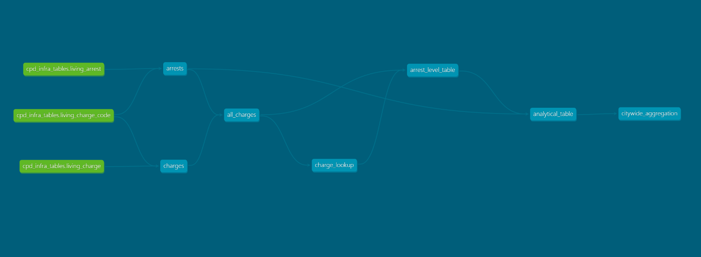

### About
These are the preliminary data models I am developing to systematically increase the granularity of drug violation arrests observed in the University of Chicago Crime Lab's Chicago PD Data Infrastructure (CPD Infra).

### Requirements
1. `requirements.yml`
2. CPD Infra's dev server

### Instructions
1. Configure `profiles.yml` accordingly using environment variables.
1. Activate virtual environment, then do `dbt debug` to ensure that you set up dbt correctly.
1. Do `dbt run` to materialize the data models in `./models/` onto the schema defined in `profiles.yml`. The DAG below originates from `static_index.html`, the static file produced by doing `dbt docs generate --static`.

